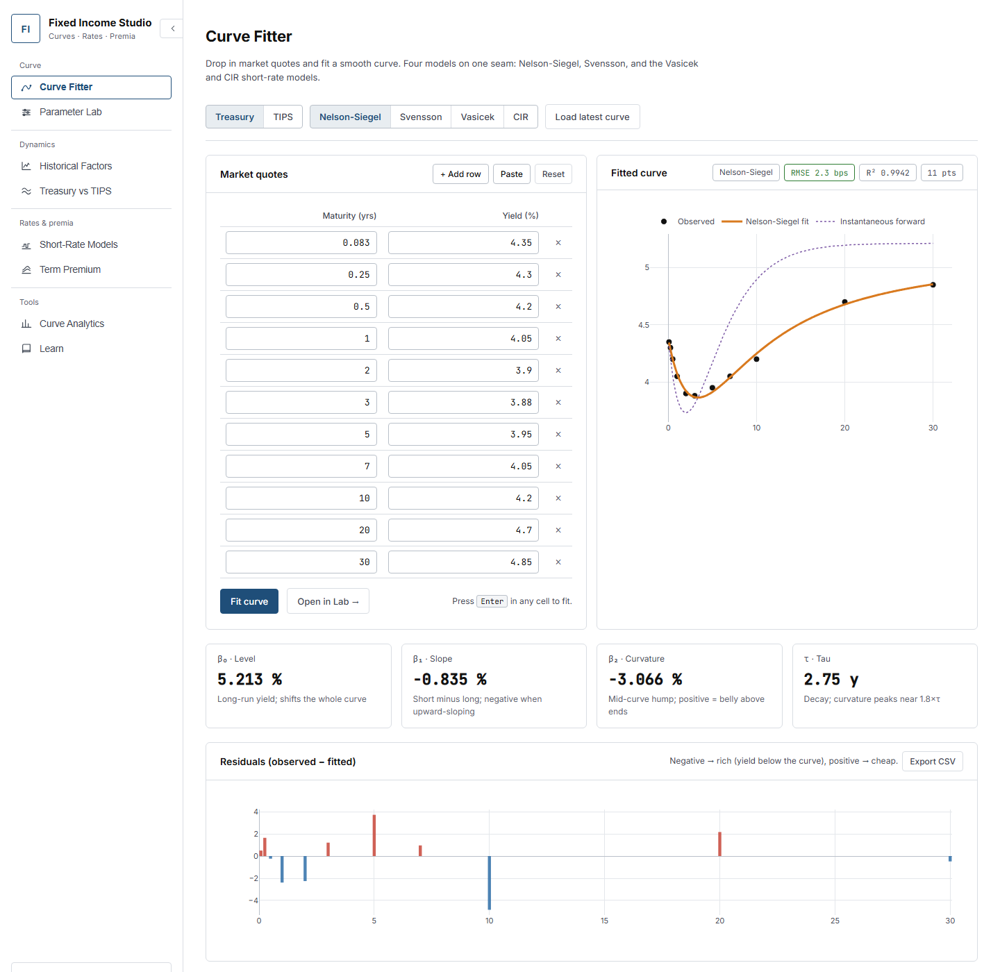
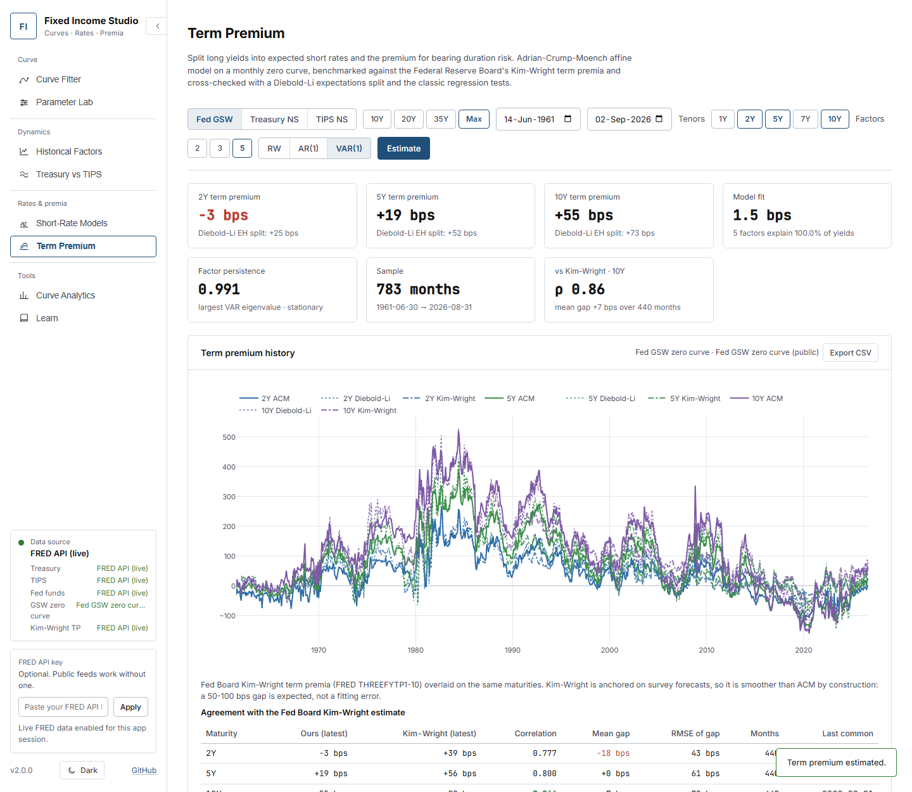
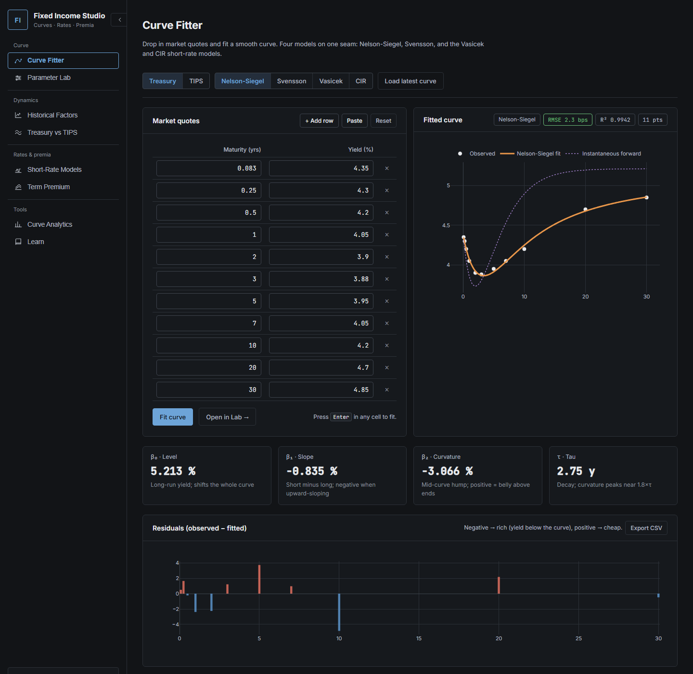
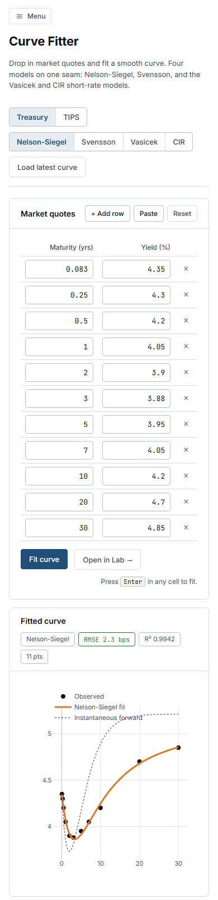

# Fixed Income Studio

[](https://github.com/alanvaa06/Fixed_Income_Studio/actions/workflows/ci.yml)
[](https://www.python.org/downloads/)
[](https://opensource.org/licenses/MIT)

A Python toolkit and browser studio for U.S. Treasury curve analysis: fit Nelson-Siegel, Svensson, Vasicek and CIR curves to live public data, run Diebold-Li factor dynamics, estimate short-rate models under both measures, decompose long yields into expected short rates and an Adrian-Crump-Moench term premium, and price bonds off any curve. Every number reports which data source produced it, and the whole test suite runs offline.



## Quick start

```bash
git clone https://github.com/alanvaa06/Fixed_Income_Studio.git
cd Fixed_Income_Studio
pip install -e ".[webapp,data]"
python scripts/run_webapp.py          # http://127.0.0.1:5000
```

No configuration needed: curves come from treasury.gov, FRED's public CSV export and the Federal Reserve Board's GSW tables. A FRED API key (`FRED_API_KEY`, or pasted into the sidebar) switches the Treasury, TIPS and fed-funds series to the FRED API. If nothing is reachable the app falls back to deterministic synthetic data and says so.

| Variable | Effect |
|---|---|
| `FRED_API_KEY` | Use the FRED API for Treasury, TIPS and fed funds |
| `NELSON_SIEGEL_OFFLINE=1` | Never touch the network (the tests set this) |
| `NELSON_SIEGEL_CACHE_DIR` | Where the GSW table is cached, default `~/.cache/nelson_siegel` |

## Using the Studio

| Tab | Use it to |
|---|---|
| **Curve Fitter** | Paste quotes or load today's curve; fit any of the four models; read factors, forwards, residuals, RMSE and R2; export CSV. |
| **Parameter Lab** | Move the Nelson-Siegel and Svensson factors by hand and watch the curve, the per-factor contributions and the hump location. |
| **Historical Factors** | Factor histories with panel-estimated decays, Diebold-Li forecasts with 90% bands, rolling-origin backtests. |
| **Treasury vs TIPS** | Nominal and real factor histories side by side, breakeven inflation, factor correlations. |
| **Short-Rate Models** | Estimate Vasicek or CIR on fed funds or a bill by OLS or exact MLE, calibrate to today's curve, compare physical and risk-neutral long-run means, simulate paths. |
| **Term Premium** | ACM term premia on the GSW zero curve since 1961, benchmarked against the Fed Board's Kim-Wright series, with the Diebold-Li expectations split, the yield decomposition and Campbell-Shiller / Fama-Bliss tests. |
| **Curve Analytics** | Curve moves, carry and roll-down, forward table, spreads and butterflies, rich/cheap ranking, PCA, and a bond calculator (price, yield, duration, convexity, DV01, z-spread, key-rate durations). |
| **Learn** | Plain-language notes on every model and data source. |

`Alt+1` to `Alt+8` switch tabs, `Alt+T` toggles light and dark, `Enter` in a quote cell fits. Changing a control after an estimate marks the results stale until you re-run.



<p align="center">
  
  
</p>

### REST

Every tab is backed by a JSON endpoint under `/api`. Yields are in percent, maturities in years, spreads in basis points; each response carries `sources`, `is_synthetic` and `public_sources`.

```bash
curl -s "http://127.0.0.1:5000/api/term-premium?source=gsw&start=1961-06-01&maturities=2,10&factors=5" | jq .latest_term_premium
curl -s -X POST http://127.0.0.1:5000/api/bond -H "Content-Type: application/json" \
  -d '{"maturity": 10, "coupon": 4.0, "price": 98.5}' | jq '{ytm, modified_duration, z_spread_bps}'
```

The full endpoint list is in [ARCHITECTURE.md](ARCHITECTURE.md).

### Python

```python
import numpy as np
from nelson_siegel import TreasuryNelsonSiegelModel, VasicekModel, YieldCurveAnalyzer, Bond, bond_report

mats = np.array([0.25, 1, 2, 5, 10, 30])
ylds = np.array([0.0495, 0.0465, 0.0430, 0.0395, 0.0405, 0.0435])   # decimals

ns = TreasuryNelsonSiegelModel().fit(mats, ylds)
vas = VasicekModel().fit(mats, ylds)
print(ns.get_factors(), vas.half_life())

analyzer = YieldCurveAnalyzer()                                        # public feeds, or FRED with a key
tp = analyzer.term_premium_analysis("gsw", "1961-06-01", maturities=(2, 5, 10), n_factors=5)
print(tp["term_premium"].tail())                                       # ACM term premia, decimals

print(bond_report(Bond(maturity=10, coupon=0.04), ns, price=98.5)["modified_duration"])
```

## Methods and references

| Component | Method | Paper |
|---|---|---|
| Curve fit | Nelson-Siegel and Svensson, betas closed-form given the decays, decays profiled on a grid and refined locally | Nelson and Siegel (1987); Svensson (1994) |
| Factor dynamics | Random walk, AR(1) and VAR(1) on the factors; iterated forecasts; expanding-window backtests | Diebold and Li (2006) |
| Short rate | Vasicek and CIR with closed-form bond prices; physical parameters by OLS on the exact discretisation or exact MLE (Gaussian, non-central chi-square); risk-neutral drift from the cross-section | Vasicek (1977); Cox, Ingersoll and Ross (1985) |
| Term premium | Three-step regression estimator on a monthly zero panel: principal-component factors, VAR(1), excess-return regressions, prices of risk, affine recursions; term premium = fitted minus risk-neutral yield | Adrian, Crump and Moench (2013) |
| Expectations hypothesis | Slope of future yield changes on the term spread, and excess returns on the forward spread, Newey-West errors | Campbell and Shiller (1991); Fama and Bliss (1987) |
| Zero curve | Federal Reserve Board GSW Svensson parameters evaluated on a monthly 1 to 120 month grid | Gurkaynak, Sack and Wright (2007) |
| Benchmark | Fed Board Kim-Wright term premia (FRED `THREEFYTP1`-`THREEFYTP10`), a survey-anchored three-factor model, so smoother than ACM by construction | Kim and Wright (2005) |

Validation: with five factors on the full GSW sample, the 10-year ACM term premium matches the New York Fed's published ACM series at correlation 1.000 with a 5 bps gap standard deviation (1961-2026). The ACM estimator is also checked against a simulated affine economy in the tests.

- Adrian, T., Crump, R. K. and Moench, E. (2013). Pricing the term structure with linear regressions. *Journal of Financial Economics*, 110(1).
- Campbell, J. Y. and Shiller, R. J. (1991). Yield spreads and interest rate movements: a bird's eye view. *Review of Economic Studies*, 58(3).
- Cox, J. C., Ingersoll, J. E. and Ross, S. A. (1985). A theory of the term structure of interest rates. *Econometrica*, 53(2).
- Diebold, F. X. and Li, C. (2006). Forecasting the term structure of government bond yields. *Journal of Econometrics*, 130(2).
- Fama, E. F. and Bliss, R. R. (1987). The information in long-maturity forward rates. *American Economic Review*, 77(4).
- Gurkaynak, R. S., Sack, B. and Wright, J. H. (2007). The U.S. Treasury yield curve: 1961 to the present. *Journal of Monetary Economics*, 54(8).
- Kim, D. H. and Wright, J. H. (2005). An arbitrage-free three-factor term structure model and the recent behavior of long-term yields and distant-horizon forward rates. FEDS 2005-33.
- Nelson, C. R. and Siegel, A. F. (1987). Parsimonious modeling of yield curves. *Journal of Business*, 60(4).
- Svensson, L. E. O. (1994). Estimating and interpreting forward interest rates: Sweden 1992-1994. NBER Working Paper 4871.
- Vasicek, O. (1977). An equilibrium characterization of the term structure. *Journal of Financial Economics*, 5(2).

## Data sources

| Source | Key | Used for |
|---|---|---|
| FRED API | yes | Treasury `DGS*`, TIPS `DFII*`, fed funds `DFF` |
| U.S. Treasury daily yield-curve XML | no | Nominal and real par curves |
| FRED public `fredgraph.csv` | no | Any FRED series, same ids |
| Fed Board GSW tables | no | Svensson parameters and zero yields since 1961 (nominal) and 1999 (TIPS) |
| Fed Board Kim-Wright premia via FRED | no | Term-premium benchmark |
| Synthetic | no | Deterministic calendar-anchored fallback |

## Development

```bash
pip install -e ".[webapp,data,dev]"
pytest -q --no-cov            # 181 tests, no network
python scripts/run_webapp.py --debug
```

Code layout, endpoint contracts and design records: [ARCHITECTURE.md](ARCHITECTURE.md), [PRODUCT.md](PRODUCT.md), [DESIGN.md](DESIGN.md).

## License

MIT. See [LICENSE](LICENSE).
